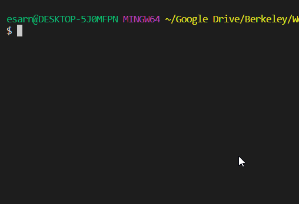

# Terminal-Hangman

Welcome to Terminal-Hangman! A classic hangman game application solely based on console interaction on your pc or server! The goal is to guess the letters correctly in order to uncover the word, and you only get 10 incorrect tries! To play, you may only press alphabetical letters on your keyboard and hit enter to submit. The game only accepts one letter at a time.

## Getting Started

* In order to run this on your preffered machine, you will either need to install [NodeJS](https://nodejs.org/en/) or [Git](https://git-scm.com/downloads). 

* Then, you must download the entire repository, as all of the files (except for images) are necessary to run the javascript game.

* After you have the game folder, you may move on to the Installation phase.

### Installing

* To install important dependencies, you may direct your command-prompt/terminal to the main game folder and type `npm i` to install the list of packages (listed in package.json).

## Deployment

After you have installed the packages through NodeJS (use terminal) or Git (use git-bash-terminal), use the respective terminal to run the game using `node index.js`, where index.js is the main game file. 

## Built With

* Javascript: Coded in JS

* NPM Packages
    * [Colors](): For a variety of terminal colors
    * [Inquirer v6.2.1](): For a clean UI on the terminal
    * [RandomWords](https://www.npmjs.com/package/random-words): For generating a new word per round

* [NodeJS](https://nodejs.org/en/): Application running the game files

## Authors

* **Esar Behlum**
